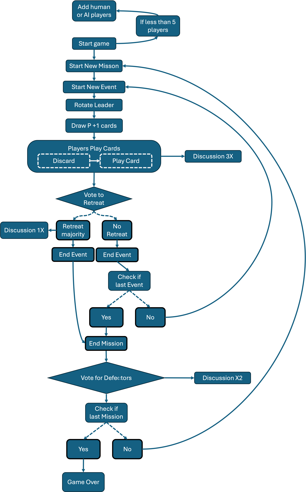

# DeceptionGame

This is not game of deception.

<!-- [![Actions Status][actions-badge]][actions-link]
[![Documentation Status][rtd-badge]][rtd-link]

[![PyPI version][pypi-version]][pypi-link]
[![Conda-Forge][conda-badge]][conda-link]
[![PyPI platforms][pypi-platforms]][pypi-link]

[![GitHub Discussion][github-discussions-badge]][github-discussions-link] -->

<!-- SPHINX-START -->

<!-- prettier-ignore-start -->
<!-- [actions-badge]:            https://github.com/intel-sandbox/iaia.DeceptionGame/workflows/CI/badge.svg
[actions-link]:             https://github.com/intel-sandbox/iaia.DeceptionGame/actions
[conda-badge]:              https://img.shields.io/conda/vn/conda-forge/DeceptionGame
[conda-link]:               https://github.com/conda-forge/DeceptionGame-feedstock
[github-discussions-badge]: https://img.shields.io/static/v1?label=Discussions&message=Ask&color=blue&logo=github
[github-discussions-link]:  https://github.com/intel-sandbox/iaia.DeceptionGame/discussions
[pypi-link]:                https://pypi.org/project/DeceptionGame/
[pypi-platforms]:           https://img.shields.io/pypi/pyversions/DeceptionGame
[pypi-version]:             https://img.shields.io/pypi/v/DeceptionGame
[rtd-badge]:                https://readthedocs.org/projects/DeceptionGame/badge/?version=latest
[rtd-link]:                 https://DeceptionGame.readthedocs.io/en/latest/?badge=latest -->

<!-- prettier-ignore-end -->

### Playing Online with AI

Take control of the play script: `chmod u+x play_game.sh`

* `./play_game.sh`

This will start the backend server and open a browser tab with the game loaded.  

Enter a lobby name and password

Click "Add AI Player", this will open a menu of models to choose from. 

Start a VLLM instance with your favorite LLM from the menu and take note of the IP and port. 

Once the VLLM server is up and running, click the icon of the model you have running and enter the IP, port, and any desired system prompt. 

Add the player to the game, and return to the Login tab to add more instances of the model to the game as players. 

Finally, add yourself as a human player. *There must be at least one human player in the lobby*

### Game Flow Chart (alpha)

